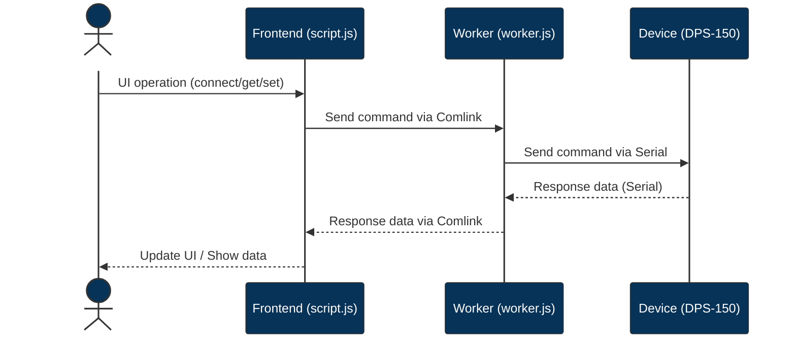

WebSerial / JavaScript implementation for FNIRSI - DPS-150 
=========================================================


[](https://www.youtube.com/watch?v=_RqsPEhD9YM )


This is a simple implementation of the FNIRSI - DPS-150 protocol in JavaScript. It is intended to be used with the WebSerial API, which is currently only available in Chrome.

https://www.fnirsi.com/products/dps-150

## FNIRSI - DPS-150 

The FNIRSI - DPS-150 is a CNC power supply working with USB-PD.

This power supply can be controlled via USB. Officially, however, only software for Windows is provided.

## Project File Structure

This project consists of the following main files and directories:

- **dps-150.js**  
  JavaScript implementation of the FNIRSI DPS-150 protocol. Handles serial communication, command construction, and parsing.

- **index.html**  
  The main web application interface. Provides the UI for interacting with the power supply via the browser.

- **script.js**  
  Contains the frontend logic, including device connection, UI state management, and data visualization.

- **worker.js**  
  Runs as a Web Worker to handle background serial communication and device control, using Comlink for messaging.

This structure separates protocol logic, UI, and background processing for maintainability and clarity.



## Getting Started

To run this project locally, simply start a static file server in the project root. For example, using [serve](https://www.npmjs.com/package/serve):

```sh
make start
or
bun run start
```

Then open the displayed local URL in Google Chrome.

## Protocol

*All of this is speculative and not accurate.*

The protocol is via serial communication. The command has the following format for both input and output.


| byte | description |
|------|-------------|
|    0 | start byte 0xf1 (out) or 0xf0 (in) |
|    1 | command |
|    2 | type |
|    3 | length of data |
|  4-n | data |
|    n | checksum |

all `float` value is in little-endian format.

### Command

| byte | decimal | description |
|------|---------|-------------|
| 0xa1 |     161 | get value   |
| 0xb0 |     176 | ?           |
| 0xb1 |     177 | set value |
| 0xc0 |     192 | ? |
| 0xc1 |     193 | connection? |


### Calculation of the checksum

```
checksum = (bytes[2] + bytes[3] ... bytes[n-1]) % 256
```
